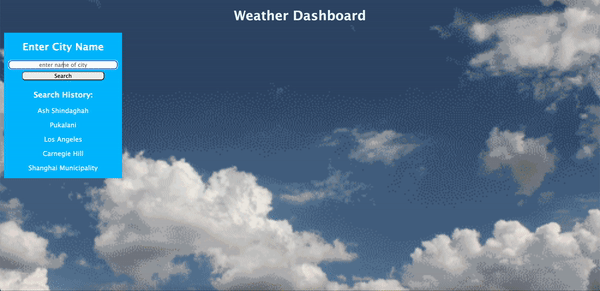

# Workday Scheduler

## Description

Weather Dashboard allows users to type in the name of a city and have the current weather and 5 day forecast for that city shown, including the current weather conditions, temperature, wind, and humidity. 

On the left-hand column, there is a search history that shows that 5 most recently searched cities. You can click on a city in the list and it will show the weather for that city. 

## Screenshot

Below is an example of the Weather Dashboard. It shows a user typing in a city and retrieving the weather for that city. It demonstrates how you can use the search history. It also shows what happens when you search for an empty/invalid city 

## Link to Weather Dashboard

The Workday Scheduler can be found by clicking [here](https://mshaari.github.io/weather-dashboard/).